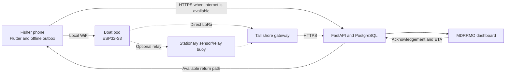

<p align="center"></p>

# AqOne

AqOne is an offline maritime safety system for municipal fishers in New Washington, Aklan.
A phone hands an SOS to a shared boat-mounted safety pod over local WiFi. The
pod sends it directly over LoRa to a tall shoreline gateway when possible;
stationary navigational buoys remain optional fixed sensor and relay nodes.

Built by **Team Aquanons** for AI Fest 2026.

## Current status

**Current competition focus:** Phase 1, the manual SOS and responder handshake.

**Last status check:** September 19, 2026.

The active backend is deployed on Render (`https://aqone-backend.onrender.com`), with `/health/ready` verified responsive. The legacy Railway service has been retired.
Obtain current evaluator access from Team Aquanons rather than relying on credentials stored in the repository.

| Area | Status | Evidence and limitation |
|---|---|---|
| Mobile pitch build | 🟡 Built and automatically tested | The September 5 build recorded `flutter analyze` with no issues and 184 passing tests. Physical handset installation and the hardware demonstration remain unverified. |
| Backend and dashboard software | 🟢 Deployed and verified | Live Render backend deployment responsive at `https://aqone-backend.onrender.com/health/ready`. |
| Phone to boat-pod WiFi | 🟡 Implemented in source | The pod address is `192.168.4.1`. The complete path has not been reverified on a physical handset and pod. |
| Boat-pod and shore firmware | 🟡 Pod and shore sketches exist, compile clean | SOS, responder ETA and chat cross LoRa; the pod has no internet of its own. Neither sketch has run on hardware. Stationary relay/sensor hardware is not yet validated. |
| Direct and optional relay LoRa | 🟡 Implemented, unproven | Direct pod-to-shore delivery and TTL flood/seen-set relay logic are written. No outdoor range has been measured — every figure in `docs/33_LORA_RF_BUDGET.md` is modelled. |
| Responder acknowledgement and ETA | 🟡 Implemented, needs a credential | The gateway reads `GET /api/sos/active` and pushes the ETA back down the mesh. That endpoint needs an operator bearer token, which must be configured before this path works. |
| AI safety features | 🟡 Prototype software exists | No component has been trained and validated on locally collected New Washington data. Synthetic scenarios support most calibration/evaluation; the marine-hazard model uses historical environmental proxy data. Field validation and deployment remain incomplete. |
| Catch activity features | 🟡 Foundation exists | Offline logging and coarse aggregation exist. The intended BFAR workflow has not been validated. |

The dated evidence ledger is [`docs/08_DEMO_AND_STATUS.md`](docs/08_DEMO_AND_STATUS.md).
Read its newest dated entry first; older entries record earlier repository states and may no longer describe current behavior.

## Delivery priorities

| Phase | Goal | Acceptance evidence |
|---|---|---|
| **1 - Manual SOS handshake** | Fisher sends SOS, MDRRMO receives it, acknowledges it, and the handset recovers the acknowledgement over a verified return path. | Repeat the complete path on real devices, record the transport used, reload the dashboard, restart the handset, and measure range. |
| **2 - AI safety support** | Add weather risk, squall detection, overdue-trip review, and drift-based search support without making SOS delivery depend on a model. | Validate missed events, false alarms, lead time, data age, and environmental coverage using appropriate evidence. If funding is secured, collect real measurements and run controlled drills in New Washington before claiming local model performance. |
| **3 - Fisheries information** | Develop consented catch activity into coarse information for BFAR planning. | Agree on the BFAR use case and validate privacy, aggregation, and decision value. |

The detailed product scope is [`docs/Aqone_PRD (2).md`](docs/Aqone_PRD%20(2).md).
Features marked as roadmap items in the PRD are not current capabilities.
Scope amendments and exclusions are recorded in [`docs/07_SCOPE_OUT.md`](docs/07_SCOPE_OUT.md), although some older authorization wording there still requires reconciliation with current backend behavior.

## How the system works



Solid arrows represent software paths present in the repository.
Dashed arrows represent the intended LoRa transport path, which has not been
range-tested outdoors. The older `buoy` directory/sketch names are retained for
firmware compatibility while the primary role is now the boat pod.

The handset uses four delivery states shared across the product:

```text
saved -> relayed -> delivered -> acknowledged
```

Their meanings are defined in [`docs/06_DELIVERY_STATES.md`](docs/06_DELIVERY_STATES.md).
The app must never display a later state without observing evidence for it.

## Start here

| If you need to... | Read... |
|---|---|
| Understand current priorities and limitations | This README |
| Inspect dated verification evidence | [`docs/08_DEMO_AND_STATUS.md`](docs/08_DEMO_AND_STATUS.md) |
| Understand the target topology | [`docs/01_ARCHITECTURE.md`](docs/01_ARCHITECTURE.md), while treating its old scope exclusions as historical |
| Work on phone to boat-pod communication | [`docs/03_PHONE_BUOY_WIFI.md`](docs/03_PHONE_BUOY_WIFI.md) and the verified fixtures in [`docs/21_WEEK1_CONTRACT_FIXTURES.md`](docs/21_WEEK1_CONTRACT_FIXTURES.md) |
| Work on LoRa frames | [`docs/02_LOAM_PACKET_SPEC.md`](docs/02_LOAM_PACKET_SPEC.md) |
| Work on backend, dashboard, or mobile APIs | [`docs/05_PUBLIC_API.md`](docs/05_PUBLIC_API.md) |
| Understand the backend layout | [`docs/18_BACKEND_STRUCTURE.md`](docs/18_BACKEND_STRUCTURE.md) |
| Understand the AI features and evidence | [`docs/17_AI_EXPLAINED_SIMPLY.md`](docs/17_AI_EXPLAINED_SIMPLY.md) and [`docs/16_QA_DISCLOSURES.md`](docs/16_QA_DISCLOSURES.md) |
| Work on localization | [`mobile/lib/l10n/README.md`](mobile/lib/l10n/README.md) and [`docs/22_LOCALIZATION_PLAN.md`](docs/22_LOCALIZATION_PLAN.md) |
| Work on visual design | [`docs/47_VISUAL_DESIGN_GUIDE.md`](docs/47_VISUAL_DESIGN_GUIDE.md) |
| Find active and historical project records | [`docs/README.md`](docs/README.md) |
| Find external event deadlines | [`docs/53_EXTERNAL_DEADLINES.md`](docs/53_EXTERNAL_DEADLINES.md) |

When documents conflict, do not choose a winner by filename or age alone.
Use the PRD for product scope, the relevant contract for an interface, the newest dated verification for observed results, and source plus tests for current implementation evidence.
Record and repair any remaining disagreement before changing a shared interface.

## Local backend

Requirements:

- Python 3.11 or newer
- PostgreSQL 14 or newer
- A disposable development database

The backend reads environment variables from the process.
It does not automatically load `backend/.env`.
Use [`backend/.env.example`](backend/.env.example) as a reference and set at least `DATABASE_URL` before running migrations.
Set `JWT_SECRET` for stable sessions and `ADMIN_SETUP_KEY` if you need to create an operator account.

```bash
cd backend
python -m venv .venv
# Activate .venv using the command for your shell.
python -m pip install -r requirements.txt
python migrate.py
python -m uvicorn app.main:app --reload
```

Check the local service:

```bash
curl http://localhost:8000/healthz
```

Expected response:

```json
{"status":"ok"}
```

Install development tools and run backend checks:

```bash
python -m pip install -r requirements-dev.txt
python -m pytest -q
python -m ruff check .
```

Use a disposable database when `DATABASE_URL` is present during tests because migration tests modify schema and data.
Do not run `python -m app.simulation.generator` against a database containing valuable records; the generator truncates operational tables before loading synthetic data.

`VESSEL_DEVICE_JWT_EXPIRY_HOURS` controls the vessel-device credential lifetime and defaults to 24 hours.

## Web and operations console checks

Requirements: Node.js 18 or newer (uses built-in test runner; no npm dependencies required).

Run the automated web checks:

```bash
# Run helper and component runtime regression suites
node --test web/test/*.test.js

# Verify syntax across all web scripts (PowerShell)
Get-ChildItem web/js, web/test -Recurse -Filter *.js | ForEach-Object { node --check $_.FullName }
```

### Browser smoke test workflow

1. **Authentication & Session:**
   - Open `web/html/login.html`.
   - Log in with valid credentials (or inspect the demo badge if bypass is active).
   - Ensure the operator profile page (`web/html/Systemprofile.html`) accurately renders authenticated identity without cross-account cache bleed.
2. **Operations Console (`web/html/dashboard.html`):**
   - **Freshness & Provenance:** Verify header connectivity pill indicates accurate freshness (`LIVE` after successful poll; `STALE` or `OFFLINE` after missed intervals; `DEMO` on synthetic items).
   - **Live Incident & Responder Loop:**
     - Click an incident in the feed or on the map to open the SOS drawer.
     - Click `Acknowledge`: verify modal target is locked, focus traps within modal, and submitting ETA/notes records acknowledgment.
     - Click `Resolve Case`: verify drawer retires upon case completion without clobbering other incidents.
   - **Audit & Timeline:**
     - Open the Audit panel (`web/html/dashboard.html`).
     - Submit a query; page through results or click `Export CSV/JSON` $\rightarrow$ confirm export and pagination strictly retain the submitted filter snapshot.
   - **Accessibility & Shortcuts:**
     - Focus an editable field (`#txt-note`, search input) $\rightarrow$ verify typing single letters (`D`, `S`, `H`) does not activate map tools.
     - Press `Escape` $\rightarrow$ verify top-level modals close first, followed by side drawers, then tool panels.

The Android platform files are already tracked.
The current source accepts the buoy HTTP endpoint `http://192.168.4.1` and requires an absolute HTTPS backend URL.
The default backend URL is the Render deployment (`https://aqone-backend.onrender.com`). The old Railway services are gone, so an APK built with a Railway `BACKEND_BASE_URL` cannot deliver a direct SOS.

```bash
cd mobile
flutter pub get
flutter analyze
flutter test
```

Build the focused Phase 1 pitch version only after those checks pass:

```bash
flutter build apk --release \
  --dart-define=PITCH_MODE=true \
  --dart-define=BACKEND_BASE_URL=https://aqone-backend.onrender.com
```

The bundled [`mobile/AqOne.apk`](mobile/AqOne.apk) predates the September 5 pitch build.
Do not present it as the current verified source build.

## Firmware

Two sketches, one per kind of board:

| Sketch | Flash it to |
|---|---|
| [`firmware/buoy/AqOneBuoy/`](firmware/buoy/AqOneBuoy/) | The boat safety-pod sketch (folder name retained for compatibility). Local WiFi for phones, plus LoRa. No internet of its own. |
| [`firmware/shore/AqOneShore/`](firmware/shore/AqOneShore/) | The board on the mast with the internet. LoRa plus a WiFi station, no access point. |

Both include `AqOneLoam.h`, the shared radio layer. The file exists in both
sketch folders and **the two copies must stay byte-identical** — a mismatch
behaves exactly like being out of range.

Board setup, required libraries, the frame format, HTTP routes, the bring-up
order and the hardware limitations are in
[`firmware/README.md`](firmware/README.md).

Before flashing:

- Replace local uplink credentials with values supplied outside version control.
- Change `LOAM_KEY`. Until you do, anyone with this repository can inject a
  distress call into the mesh.
- Confirm `LORA_FREQ_MHZ` matches the band your boards and antennas were built
  for. The repository's own docs disagree on this and it is still an open item.
- Point the firmware at a verified backend.
- The dispatcher's acknowledgement needs an operator credential on the gateway;
  without one, SOS and chat still work and the return path does not.
- Do not claim a LoRa range. The mesh is implemented; no range has been measured.

## AI and data

The AI layer is structured into calibrated physical models, causal rules, and decision-support estimators designed specifically for the New Washington and Batan Bay coastal domain. No component operates as an autonomous authority: manual SOS and rescue dispatch function independently of all model outputs, and all predictive alerts serve as advisory inputs for MDRRMO human responders. Comprehensive prospective protocols, drill frameworks, and audit resolutions are detailed in [`docs/45_AI_PROSPECTIVE_EVALUATION_AND_CLAIMS.md`](docs/45_AI_PROSPECTIVE_EVALUATION_AND_CLAIMS.md).

| Function | Model version & method | Domain & horizon | Input sources | Evidence & calibration status |
|---|---|---|---|---|
| **Marine hazard** | `aqone-hazard-v2`: GBDT + physical threshold floor | Batan Bay / coastal Aklan; 0–48h | Open-Meteo marine models, ERA5 reanalysis, bathymetry | Trained on historical weather and marine proxy data; local incident validation required. |
| **Squall nowcasting** | `aqone-squall-v2`: Barometric drop rate & front propagation vector | Buoy array baseline (~10 km); 15–90 min | Buoy telemetry array (min. 3 buoys, 5-min cadence) | Calibrated with synthetic & physical pressure drop dynamics; requires active multi-buoy telemetry. |
| **Trip anomaly** | `trip-profile-v2`: Causal empirical quantile profiling | Port to coastal grounds; 0–12h post-contact | Buoy contact logs, declared trip deadlines | Causal historical profiles ($T \le T_{\text{decision}}$); flags overdue vessels exceeding $Q_{90}$ duration for dispatcher verification. |
| **Drift simulation** | `aqone-drift-v2`: Monte Carlo leeway + shoreline stranding | Coastal water polygon; 0.5–6.0h (up to 12h conditioned) | Buoy currents, high-res coastline polygon, GFS/ECMWF wind | Physics-based leeway with land-barrier stranding; bounded by physical maximum-speed envelope ($A = \pi (V_{\max} t)^2$). |
| **Search retasking** | `aqone-search-v2`: Time-aligned negative search likelihood | Active incident drift grid; search execution time | Timed search sector bounding boxes ($p_d$) | Evaluates trajectory presence at search time; advisory recommendation for responder review, not automatic tasking. |

No foundation model or external LLM inference API runs inside the product.
AI coding assistants were used during development.
Dataset sources, licences, limitations, and measured results are documented in [`docs/16_QA_DISCLOSURES.md`](docs/16_QA_DISCLOSURES.md), [`docs/45_AI_PROSPECTIVE_EVALUATION_AND_CLAIMS.md`](docs/45_AI_PROSPECTIVE_EVALUATION_AND_CLAIMS.md), and [`web/ml/model-card.json`](web/ml/model-card.json).

## Safety and limitations

- AqOne does not guarantee message delivery, rescue, prediction accuracy, or survival.
- The manual SOS path must work independently of every model.
- Drift output is a probability distribution, not a location guarantee.
- Automated alerts can miss events and create false alarms; responders retain authority.
- RF allocation, transmit power, duty cycle, device certification, and institutional authority require confirmation before deployment.
- Fisher location and catch data require explicit purpose, access, retention, and privacy controls.
- Tagalog and Aklanon translations remain unreviewed drafts.

## Repository layout

```text
backend/       FastAPI, PostgreSQL migrations, AI services, and tests
firmware/      ESP32-S3 firmware: buoy/ (boat pod & buoy) and shore/ (gateway) sketches
mobile/        Flutter handset application
web/           MDRRMO dashboard and browser hazard model
docs/          Contracts, references, decisions, plans, and verification records
fixtures/      Shared contract fixtures
```

## Team

| Member | Responsibility |
|---|---|
| Lenard | Backend, architecture, and deployment |
| Arnold | Website Dashboard |
| Daniel | Hardware and buoy firmware |
| Jade | Flutter Application |
| Doreen Kay | Pitching, Company branding and business direction |
| Kc Condes | Pitching and business development support |

Contributors should read [`AGENTS.md`](AGENTS.md) and the documentation register in [`docs/README.md`](docs/README.md) before changing shared contracts.

## License

Copyright 2026 Team Aquanons.
This repository is currently proprietary; see [`LICENSE`](LICENSE) for the complete terms.
