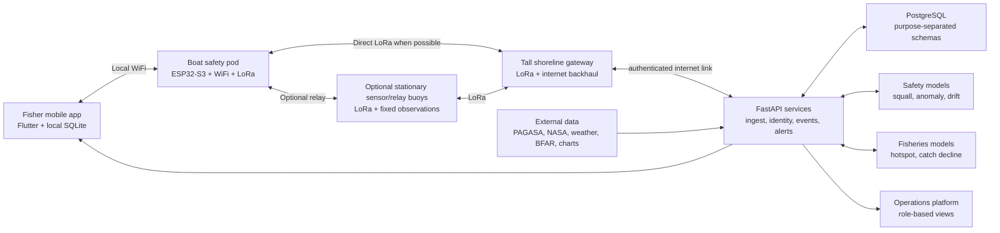

# AqOne Integrated System Design

**Team:** Aquanons  
**Pilot location:** New Washington, Aklan, Philippines  
**Document status:** Integrated baseline derived from `Aquanons_TechnicalProfile.md` and `AqOne_ASU_Research_Proposal_Form5.docx.md`  
**Program horizon:** 24 months

## 1. Product definition

AqOne is a shared maritime platform for municipal fishing communities. It combines:

1. **AqOne Safety** — offshore communication, localized weather warnings, manual SOS, overdue-vessel detection, and drift-informed search-and-rescue support; and
2. **AqOne Fisheries Intelligence** — voluntary catch logging, fish-hotspot guidance, catch-decline decision support, and regulator-declared zone advisories.

Both systems use the same hybrid radio infrastructure, mobile application,
backend, and operations platform, but they do **not** share all data by default.
Boat pods provide the primary SOS path; stationary buoys provide fixed
environmental observations and optional relay coverage. Safety functions are the
trust anchor and must work without enrollment in fisheries monitoring. Catch data
is collected only through separate, informed opt-in consent and is never
required to send an SOS, receive a warning, or obtain rescue assistance.

The integrated design keeps the strongest idea from each source document: the proposal's focused, low-cost search-and-rescue infrastructure and the technical profile's longer-term fisheries and livelihood intelligence. Integration occurs at the infrastructure and user-experience layers, while purpose separation is preserved at the data, permission, and governance layers.

## 2. Problem and design response

Municipal fishers in Aklan routinely operate beyond dependable cellular coverage. When a vessel is disabled, capsizes, or fails to return, responders may learn about it hours later and may have only an approximate route from which to begin searching. The same communities also lack localized fishing intelligence, while BFAR and LGUs often rely on catch data too aggregated to reveal changes in a particular zone.

AqOne addresses these problems through one field infrastructure with two bounded missions:

| Need | AqOne response | Primary beneficiary |
|---|---|---|
| Communication beyond cellular coverage | Phone-to-boat-pod WiFi, direct pod-to-shore LoRa, and optional stationary-buoy relay | Fishers and families |
| Faster distress reporting | Manual SOS, last-known position, and confidence-scored overdue alerts | MDRRMO and PCG |
| Localized hazardous-weather warning | Barometric and motion observations fused with official weather data | Fishers and responders |
| Smaller, prioritized search area | OpenDrift/Leeway probability field with local observations and responder updates | MDRRMO and PCG |
| Fuel and time lost searching for fish | Probabilistic hotspot heatmap using voluntary catch and environmental data | Fishers |
| Delayed recognition of localized catch decline | Interpretable rolling-baseline flags for human review | BFAR and LGU fisheries offices |

## 3. Integration principles

### 3.1 Safety is unconditional

Every registered fisher can use messaging, warnings, check-ins, and SOS without submitting catch data. An emergency packet receives the highest network and backend priority. No fisheries-related restriction, account state, or missing consent may block safety service.

### 3.2 One platform, separated purposes

The mobile app and operations platform provide a consistent experience, but access is role- and purpose-based:

- Fishers see their safety state, messages, weather and zone warnings, optional family sharing, and—if separately enabled—catch and hotspot tools.
- MDRRMO and PCG see incidents, evidence, last-known positions, drift fields, search sectors, and network health needed for rescue.
- BFAR and authorized LGU fisheries staff see aggregated fisheries evidence, confidence and coverage indicators, and declared-zone tools—not identifiable safety trip histories.
- System administrators see infrastructure health and security audit events, not unrestricted operational data.

### 3.3 Human authority remains explicit

AqOne provides decision support. It does not autonomously declare a vessel lost, dispatch a rescue unit, close a fishing zone, penalize a fisher, or enforce a restriction. Authorized responders triage distress alerts; BFAR or the LGU reviews evidence and makes fisheries-management decisions.

### 3.4 Confidence and uncertainty are visible

Weather, overdue, hotspot, catch-decline, and drift outputs must show confidence, data age, coverage, and relevant limitations. Missing contact outside measured pod/fixed-node coverage is not treated as an emergency by itself.

### 3.5 Store first, synchronize when possible

The system assumes intermittent connectivity. Phones, buoys, gateways, and the backend use durable identifiers, deduplication, acknowledgements, retry limits, and clear delivery states.

## 4. Integrated architecture

The **tall shoreline gateway** is the standard bridge from the field radios to
the backend. A direct boat-pod link is the default path; a stationary buoy is
added as a relay only where field measurements or fixed-sensor needs justify it.

### 4.1 Mobile application

The Flutter application provides:

- one-touch manual SOS with explicit sent, relayed, delivered, and acknowledged states;
- periodic lightweight check-ins during an active trip;
- offline message and event outbox using local SQLite;
- cached official forecasts and localized AqOne warnings;
- permission-based family trip visibility;
- optional catch logging, including species, estimated volume, time, location, and photo;
- hotspot and regulator-declared zone overlays; and
- accessible interaction through large targets, simple navigation, and English/Aklanon localization.

The phone does not contain a LoRa radio. It reaches the network through the
nearby boat pod using short-range WiFi. BLE may be retained for provisioning or
short-range fallback only after field testing; design claims about the pod's
phone-contact range must be based on measured results.

### 4.2 Field nodes

The boat pod is shared removable equipment rather than a personal subscription
device. Stationary solar-powered buoys remain public/shared infrastructure when
their sensing or relay position is useful.

The boat-pod reference node includes:

- ESP32-S3-class microcontroller;
- SX1262-class LoRa radio and marine-suitable antenna;
- WiFi access point and optional BLE;
- GNSS receiver for the boat/pod position;
- physical SOS button;
- battery, power monitoring, and flash-backed queue;
- external LoRa antenna suitable for the pod mounting position; and
- weather-resistant strap-on enclosure.

The stationary sensor/relay buoy includes the relevant subset of:

1. **Mesh relay:** stores and forwards packets toward the gateway using bounded hop counts and duplicate suppression.
2. **Environmental station:** records pressure, motion, location, radio quality, and device health.
3. **Edge alert source:** emits low-bandwidth hazard and infrastructure events even when raw telemetry cannot immediately reach the backend.

Stationary-buoy motion indicates **conditions at the buoy's fixed location**, not
the capsize of a particular boat. The UI must label these events as `Dangerous
Wave Zone` or `Capsizing-Risk Conditions`, never as a confirmed vessel capsize.

### 4.3 Mesh and gateway

Packets use compact, versioned contracts containing at minimum:

- protocol version and message type;
- event ID and originating device ID;
- timestamp and location when available;
- priority and time-to-live/hop limit;
- encrypted payload and integrity check;
- relay metadata; and
- power/health flags where relevant.

Suggested priority order is:

1. manual SOS and responder acknowledgement;
2. high-confidence distress escalation;
3. severe localized weather warning;
4. routine vessel check-in and safety message;
5. field-node health telemetry;
6. catch log and other delay-tolerant data.

The gateway authenticates to the backend, uploads queued packets idempotently, receives acknowledgements and outbound warnings, and preserves messages during internet outages.

### 4.4 Backend and data platform

The backend uses FastAPI and PostgreSQL with an append-only event log, idempotent ingest, background workers, and Server-Sent Events or an equivalent lightweight channel for operations updates. Core services are:

- identity, roles, consent, and trip management;
- device registry and field-network health;
- packet ingest, validation, deduplication, and acknowledgement;
- safety-event projection and incident workflow;
- environmental-data ingestion and feature preparation;
- safety-model execution;
- fisheries-log validation and feature preparation;
- fisheries-model execution;
- notification routing; and
- immutable access and decision audit logs.

Safety and fisheries records use separate schemas or stores, encryption keys, retention rules, and service permissions. A controlled aggregation job—not an unrestricted database join—is the only normal path from voluntary catch records to fisheries analysis.

## 5. AqOne Safety subsystem

### 5.1 Manual SOS

A fisher triggers SOS in the app or presses the pod's physical button. The app
packages the fisher/vessel pseudonymous ID, event time, current or last reliable
position, trip ID, and optional incident category. It attempts cellular delivery
if available and boat-pod delivery in parallel or priority order. The pod sends
directly to the shore gateway when possible; optional relays retain the packet
until acknowledged or expired.

The operations platform distinguishes:

- **Created:** stored safely on the phone;
- **Relayed:** accepted by a boat pod or internet endpoint;
- **Delivered:** accepted by the backend;
- **Acknowledged:** seen and accepted by an authorized responder; and
- **Resolved:** closed with a reason and audit record.

### 5.2 Localized squall nowcasting

The nowcasting pipeline combines stationary-buoy pressure sequences,
position/time, motion observations, official PAGASA warnings, and available wind
or sea-state products. It estimates the probability and expected lead time of a
hazardous localized squall for defined zones.

Development starts with transparent baselines such as pressure-tendency thresholds and forecast persistence. More complex spatiotemporal models are adopted only if they improve time-separated and location-separated validation. Warnings are geographically targeted and may use severity levels such as `Advisory`, `Prepare to Return`, and `Return Now`. Official PAGASA warnings remain clearly attributed and are never visually presented as AqOne predictions.

### 5.3 Buoy-observed wave hazards

The IMU provides a separate evidence stream from barometric nowcasting:

- an oscillatory high-amplitude signature may indicate a dangerous-wave zone;
- sustained extreme motion or tilt may indicate capsizing-risk conditions at the buoy location; and
- ordinary waves, mooring behavior, collision, biofouling, or hardware faults can produce similar signals.

Thresholds must be calibrated through controlled and on-water trials. Until validated, these are environmental advisories with visible confidence—not automatic vessel-distress alerts.

### 5.4 Overdue and trip-anomaly detection

The initial baseline is coverage-aware and interpretable:

- If a vessel misses an expected check-in and its last position was within measured buoy coverage, the system raises an overdue candidate.
- If the last position was outside measured coverage, the state is `Out of coverage—last known position`, not an emergency.
- Scheduled return time, recent weather, prior trip variability, battery/app state, and nearby observations contribute supporting evidence.

As sufficient history accumulates, a per-vessel model learns ordinary route, timing, waypoint sequence, and contact patterns. It predicts expected next contact and generates a calibrated anomaly score. The platform fuses this with coverage, weather, and peer or buoy corroboration into a responder-facing confidence score. Low-confidence events enter a verification queue; they do not trigger an unqualified emergency declaration.

### 5.5 Drift prediction and search allocation

After a confirmed or responder-escalated incident, AqOne initializes an OpenDrift/Leeway ensemble using last-known position uncertainty, elapsed time, wind, currents, and plausible search-object classes. It produces:

- a time-indexed probability density, not a single predicted point;
- uncertainty contours;
- ranked search sectors for defined time windows; and
- revised probabilities as responders mark searched sectors or enter sightings.

Buoy GNSS watch-circle movement and IMU/mooring response may be investigated as local current proxies. They are not called direct current measurements until validated against an independent reference instrument. Local correction is used only when evaluation demonstrates that it improves the uncorrected physical baseline.

## 6. AqOne Fisheries Intelligence subsystem

### 6.1 Voluntary catch logging

Fishers separately opt in to record species, estimated volume, GPS/time, and optional evidence such as a photo. The app explains:

- what is collected;
- whether precise coordinates or spatially coarsened coordinates are stored;
- who can see individual entries;
- how long records are retained;
- how consent can be withdrawn; and
- that refusal has no effect on safety services.

Financial entries and market-pricing tools are optional extensions and should be added only when they serve a validated fisher need.

### 6.2 Fish-hotspot guidance

The hotspot pipeline joins consented, quality-checked catch logs with seasonal indicators and environmental variables such as sea-surface temperature, current vectors, weather, and historical BFAR baselines. GPS observations are spatially binned and protected against exposing an individual's exact productive location.

A gradient-boosted tabular model is an appropriate candidate, evaluated against seasonal and historical-average baselines. The map displays relative probability or suitability, observation density, model age, and confidence. It must not imply guaranteed catch or safe navigability; safety warnings override and visually supersede hotspot guidance.

### 6.3 Catch-decline decision support

Catch-decline detection uses an interpretable rolling comparison against each zone's historical and seasonal baseline. A zone is surfaced only when:

- decline persists across multiple reporting periods;
- a minimum number of independent reporters contributes;
- reporting volume and species mix are sufficient;
- the result is not better explained by weather, seasonality, effort, or missing data; and
- uncertainty and known bias are displayed.

The output is a `Review recommended` flag. BFAR/LGU personnel review the evidence and may declare a cooldown or restriction through their lawful process. Only after that external decision may AqOne show a regulator-declared zone overlay. AqOne never creates or enforces the restriction autonomously.

## 7. Operations platform and role boundaries

The original concept of a shared dashboard is retained as one operations platform with purpose-specific workspaces.

| Workspace | Permitted capabilities | Explicit exclusions |
|---|---|---|
| MDRRMO/PCG Safety | SOS triage, anomaly evidence, last-known position, drift field, search sectors, responder updates, network health | Individual catch logs, hotspot-source records |
| BFAR/LGU Fisheries | Aggregated catch trends, model confidence, coverage/bias indicators, human-reviewed zone notices | Identifiable safety trip trails or family permissions |
| Infrastructure Operations | Device health, battery, radio quality, firmware, gateway status | Content of private messages and unrestricted operational histories |
| Fisher/Family | Own trip state and messages; limited family view with revocable consent | Other fishers' routes or catch locations |

Severe safety alerts appear persistently within authorized safety workspaces. A fisheries officer who is not also an authorized emergency responder does not gain incident access merely because both tools are hosted in the same web application.

## 8. Data governance, ethics, and security

### 8.1 Purpose-based data classes

| Data class | Examples | Default access | Default handling |
|---|---|---|---|
| Emergency | SOS, last-known position, incident evidence | Authorized MDRRMO/PCG responders | Highest priority; incident retention policy |
| Routine safety | Check-ins, delivery state, trip timing | Fisher and authorized safety service | Minimized; short operational retention |
| Family sharing | Trip status, limited position | Explicitly approved family accounts | Revocable and time-bound |
| Fisheries | Catch, species, effort, coarse location | Fisher; aggregated access for authorized analysts | Separate opt-in and retention |
| Infrastructure | Battery, radio quality, buoy position | Operations staff | No message content |
| Model/audit | Model version, score, decision and access events | Authorized reviewers/auditors | Append-only and integrity-protected |

### 8.2 Required safeguards

- Follow the Philippine Data Privacy Act of 2012 principles of transparency, legitimate purpose, proportionality, and data-subject rights.
- Use encryption in transit and at rest, device credentials, key rotation, least-privilege roles, and authenticated firmware updates.
- Pseudonymize vessel and user identifiers in modeling datasets.
- Spatially coarsen catch locations before regulator or research use unless a separately approved purpose requires precision.
- Make family visibility explicit, granular, revocable, and off by default.
- Record every responder escalation, fisheries review, zone publication, and sensitive-data access in an audit trail.
- Prohibit use of safety telemetry for fisheries enforcement without a new lawful basis, governance review, community consultation, and explicit policy change.
- Establish breach response, retention/deletion schedules, consent withdrawal, and appeal/correction procedures before pilot enrollment.

## 9. Delivery plan

Integration does not mean attempting every model at once. The 24-month program uses staged gates while maintaining a single architecture.

### Phase 1 — Trust and transport foundation

- Validate fisher and responder requirements.
- Freeze packet, API, event, consent, and role contracts.
- Prototype the strap-on boat pod, power system, antennas, optional fixed sensor/relay buoy, LoRa transport, and tall shoreline gateway.
- Demonstrate airplane-mode phone → boat pod → direct LoRa → gateway → backend → operations platform delivery.
- Implement manual SOS, message states, network health, offline outbox, and access auditing.

**Exit gate:** repeatable delivery and acknowledgement under documented range, latency, loss, and power conditions.

### Phase 2 — Safety intelligence

- Deploy environmental sensors and establish transparent baselines.
- Calibrate squall and stationary-buoy-motion advisories.
- Launch coverage-aware overdue detection, then learned trip profiles when enough history exists.
- Integrate and validate OpenDrift/Leeway search fields and responder re-tasking.

**Exit gate:** safety models outperform defined baselines without exceeding responder-approved false-alarm thresholds.

### Phase 3 — Fisheries intelligence pilot

- Conduct a separate consent and governance review with fishers and BFAR/LGU.
- Launch voluntary catch logging to a limited cohort.
- Evaluate hotspot guidance against seasonal/historical baselines.
- Evaluate catch-decline flags for stability, representativeness, and livelihood risk.
- Publish only aggregated, human-reviewed regulator views.

**Exit gate:** sufficient independent participation, acceptable bias/coverage, no degradation of safety adoption, and written stakeholder approval.

### Phase 4 — Integrated field evaluation and handover

- Run supervised pilot operations in New Washington.
- Train fishers, MDRRMO/PCG responders, BFAR/LGU users, and maintainers.
- Evaluate technical, model, adoption, governance, and cost outcomes.
- Prepare maintenance, procurement, institutional ownership, and scale-up plans.

## 10. Evaluation framework

### 10.1 Network and hardware

- phone-to-pod, direct pod-to-shore, and optional pod/relay range distributions under real sea conditions;
- end-to-end delivery rate and latency by priority;
- duplicate rate and successful acknowledgement rate;
- store-and-forward recovery after outages;
- energy autonomy, battery health, and maintenance interval;
- coverage maps derived from field measurements rather than nominal radio specifications; and
- time to detect node drift, damage, or loss.

### 10.2 Safety outcomes

- time from simulated/controlled incident to backend delivery and responder acknowledgement;
- false-alert and missed-event rates;
- precision/recall, calibration/Brier score, and lead time for squall warnings;
- anomaly performance on time-, vessel-, and geography-separated evaluation sets;
- drift error and search-area reduction at hours 1, 6, and 24 against the raw OpenDrift baseline; and
- responder workload and successful alert-triage rate.

### 10.3 Fisheries outcomes

- active voluntary reporters and reporting consistency;
- spatial and demographic coverage;
- hotspot performance against seasonal/historical baselines;
- calibration and usefulness of hotspot probabilities;
- catch-decline stability across reporting windows;
- false-flag review rate and evidence of reporting or adoption bias; and
- fisher-reported trust, fuel/time effect, and willingness to continue.

### 10.4 Governance and adoption

- percentage of enrolled users who understand each consent choice;
- consent withdrawal and data-correction completion time;
- unauthorized-access incidents and audit completeness;
- app retention and routine safety use;
- family, fisher, and responder satisfaction; and
- whether fisheries features change participation in safety features.

## 11. Major risks and controls

| Risk | Consequence | Control |
|---|---|---|
| Phone cannot reliably reach the boat pod | Safety path fails before LoRa transmission | Field-measure local WiFi; improve pod placement; publish actual contact range; keep a shared spare pod |
| Direct pod-to-shore gap or gateway outage | Delayed delivery | Tall gateway antenna, durable pod queues, measured optional relay buoys, and gateway redundancy |
| Excessive automatic alerts | Responder alert fatigue | Coverage-aware baseline, confidence tiers, verification queue, responder-set thresholds |
| Stationary-buoy motion mistaken for vessel distress | False incident | Label as zone condition; validate patterns; never bind buoy tilt to a specific boat |
| Current proxy is inaccurate | Misleading drift correction | Validate against reference measurements; retain uncorrected baseline; reject correction if it does not improve results |
| Catch participation is geographically biased | Unfair hotspot or decline outputs | Minimum reporter counts, coverage display, aggregation, BFAR baseline comparison, withhold low-confidence zones |
| Safety telemetry is repurposed for enforcement | Loss of trust and possible harm | Technical separation, policy prohibition, audit logs, separate consent and legal review |
| Model appears more certain than evidence permits | Unsafe decisions | Calibrated probability, data age, confidence, uncertainty contours, human authority |
| Marine exposure damages hardware | Coverage loss and maintenance burden | Environmental testing, health telemetry, modular enclosure, spares and maintenance plan |

## 12. Resolved conflicts between the source versions

1. **Safety-only versus all-in-one scope:** Both become parts of one program, but fisheries intelligence enters through a gated module after the safety foundation and its trust safeguards are proven.
2. **Shared dashboard versus surveillance risk:** The solution is one application shell with purpose-specific workspaces, separate permissions, and separated data—not one unrestricted regulator view.
3. **Fixed buoy hazard versus vessel capsize detection:** Stationary-buoy motion generates zone-condition advisories only. Vessel distress comes from manual SOS or confidence-scored trip anomalies. The boat pod can carry a physical SOS button, but it is not a guaranteed capsize detector.
4. **Simple timeout versus behavioral anomaly detection:** Coverage-aware timeout is the interpretable cold-start baseline; learned per-vessel anomaly scoring is layered on when adequate trip history exists.
5. **Mothership/mobile gateway versus shore gateway:** The shore gateway is the normal path. Mobile gateways are optional redundancy and are never the only tracked or connected node.
6. **Fleet-density versus fixed-node density:** The core path depends on pod and gateway coverage. Relay-buoy density matters only where direct links fail or fixed sensing justifies it; vessel density matters for shared-pod availability and trip-history quality.
7. **Direct current sensing versus inferred current:** GNSS/IMU mooring behavior is treated as a research proxy requiring validation, not a direct measurement.
8. **WiFi/BLE ambiguity:** WiFi is the primary phone-to-boat-pod path because the phone lacks LoRa. BLE is limited to provisioning or validated short-range fallback.
9. **One AI label for unlike problems:** Squall nowcasting, trip anomaly, physical drift, hotspot prediction, and catch-decline analysis are separate models with separate baselines and evaluation criteria.
10. **Automatic restriction language:** AqOne may display an official restriction after BFAR/LGU declares it; model output alone is only a review flag.

## 13. Explicit non-goals for the initial integrated program

- replacing PCG/MDRRMO command authority or official PAGASA warnings;
- guaranteeing continuous coverage outside the measured pod/fixed-node footprint;
- voice communication over the LoRa mesh;
- identifying a precise drift location without uncertainty;
- requiring each fisher to personally purchase boat-mounted hardware; shared pods remain part of the deployment model;
- using safety data for catch enforcement;
- guaranteeing catch or recommending fishing inside unsafe or restricted waters; and
- autonomous rescue dispatch, fisheries penalties, or zone closure.

## 14. Definition of program success

AqOne succeeds when it demonstrates that shared, maintainable offshore infrastructure can deliver a fisher's urgent message without cellular service; give responders earlier, uncertainty-aware information; warn users of localized hazards with an acceptable false-alarm burden; and support voluntary fisheries intelligence without weakening safety access or community trust.

The program should be scaled only when field evidence shows that the network is dependable, responders can operate it, fishers understand and accept its data practices, and each model improves on a transparent baseline.
