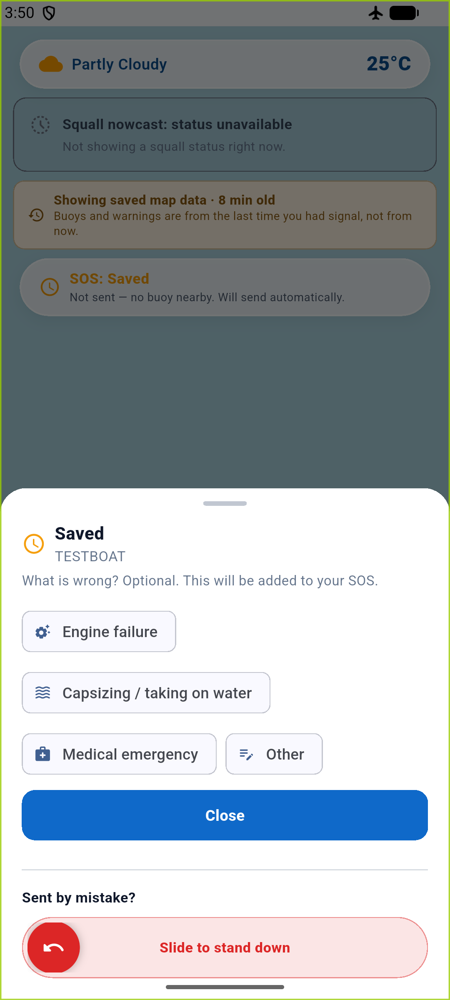

# Phase 1 verification

Date: 2026-09-25

## Automated checks

- `cd mobile && flutter analyze` completed with `No issues found!`.
- `cd mobile && flutter test` completed with `All tests passed!` (339 tests).
- The four protected test files were not modified.
- `handleSosTap` has one definition and two call sites, in Home and At sea.
- `rg -n "onHold" mobile/lib` returned no matches.
- `git diff --check` completed without whitespace errors.

## Emulator walkthrough

The Android `Medium_Phone` emulator was placed in airplane mode with Wi-Fi and mobile data disabled.
A new SOS was raised with no reachable buoy.
The screenshot shows the sheet's `Saved` situation and the explicit `Not sent - no buoy nearby. Will send automatically.` message.

The updated Dart app was loaded into the already-installed emulator app through Flutter attach and hot restart.
A fresh Gradle debug build could not complete because Gradle repeatedly failed while deleting its generated `mergeDebugAssets` directory.